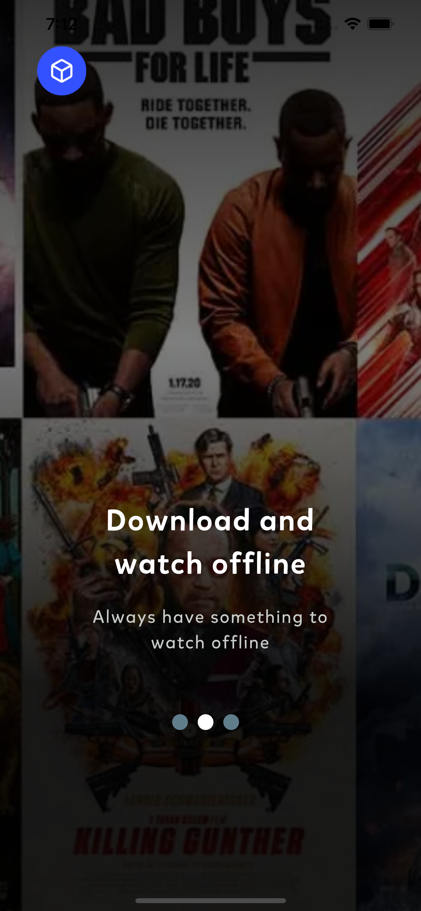

# Đồ Án Tốt Nghiệp
Đồ án tốt nghiệp 2023 bản final
# Tính năng
<ul>
    <li>Đăng nhập</li>
    <li>Đăng ký</li>
    <li>Xem Video</li>
    <li>Bình Luận</li>
    <li>Thêm danh sách yêu thích</li>
    <li>Xem Livestream</li>
</ul>

# Công nghệ sử dụng
<ul>
    <li>Firebase</li>
    <li>Flutter</li>
</ul>

# Demo ứng dụng
<table border>
    <tr>
        <td></td>
        <td></td>
        <td></td>
        <td></td>
        <td></td>
    </tr>
</table>

<table border>
    <tr>
        <td></td>
        <td></td>
        <td></td>
        <td></td>
        <td></td>
    </tr>
</table>

<table border>
    <tr>
        <td></td>
        <td></td>
        <td></td>
        <td></td>
        <td></td>
    </tr>
</table>

<table border>
    <tr>
        <td></td>
        <td></td>
        <td></td>
        <td></td>
        <td></td>
    </tr>
</table>
<table border>
    <tr>
        <td></td>
    </tr>
</table>
